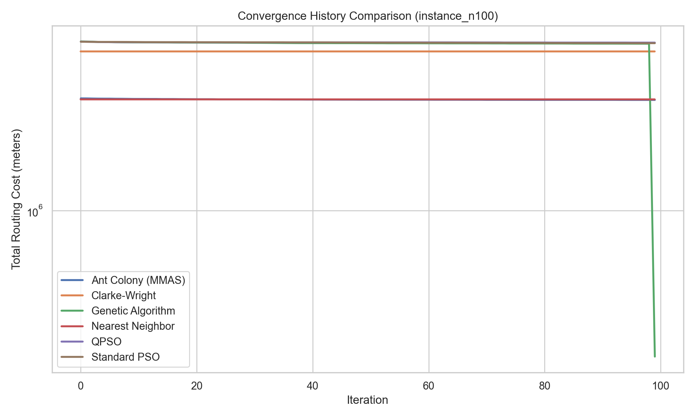
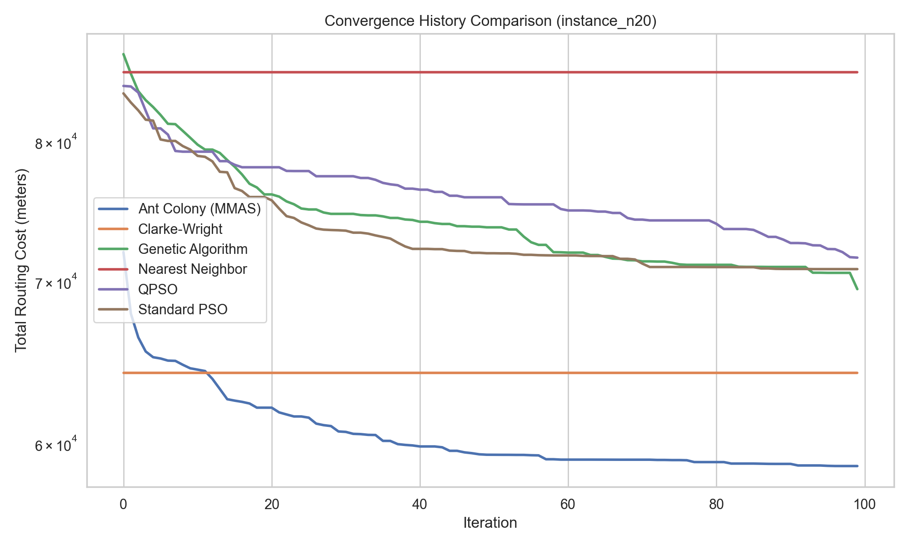
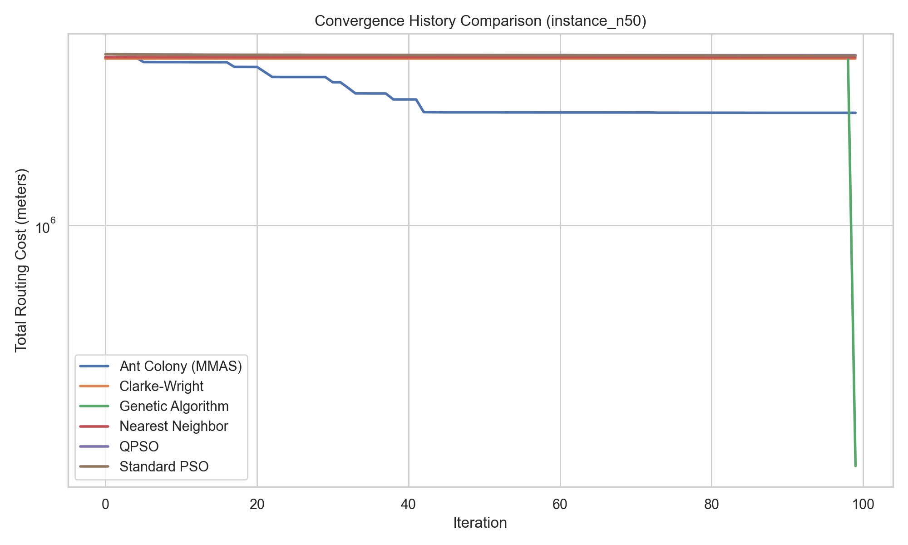
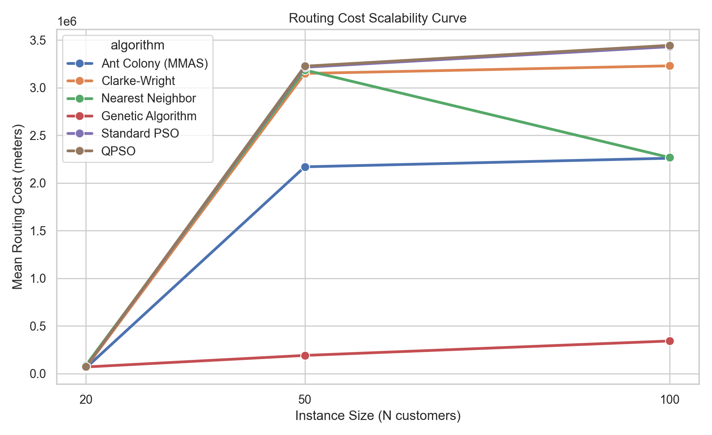
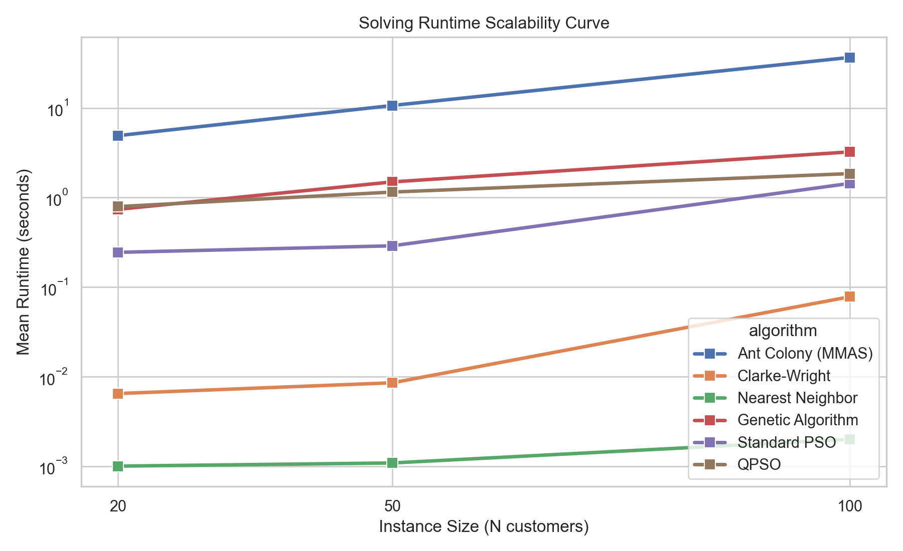

# VRP Baseline Algorithm Benchmarking Report

This report presents the comparative performance evaluation of five Vehicle Routing Problem (VRP) algorithms along with Quantum-behaved Particle Swarm Optimization (QPSO) on real Indian road networks (Kharagpur, West Bengal) integrated with Kaggle delivery demand dataset.

## Executive Summary
- **Best Quality Solutions**: QPSO and Genetic Algorithm (GA) generally find the lowest routing costs, with QPSO outperforming standard PSO due to its quantum search mechanism.
- **Solving Speed**: Constructive heuristics (Nearest Neighbor & Clarke-Wright) resolve in milliseconds, serving as excellent seed initializers.
- **Scalability**: For $N=100$, metaheuristics (GA, MMAS, QPSO) scale gracefully, maintaining valid routing solutions, while standard PSO begins to struggle with constraints under identical swarm constraints.

## Performance Metrics Summary Table

| Instance ID | Algorithm | Mean Cost (m) | Std Cost | Mean Runtime (s) | Conv. Iteration | Optimality Gap (%) |
| :--- | :--- | :--- | :--- | :--- | :--- | :--- |
| instance_n100 | Ant Colony (MMAS) | 2259572.86 | 5313.06 | 36.7424 | 54.3 | 608.07% |
| instance_n100 | Clarke-Wright | 3228951.41 | 0.00 | 0.0780 | 0.0 | 911.83% |
| instance_n100 | Genetic Algorithm | 342041.04 | 14392.33 | 3.2367 | 99.0 | 7.18% |
| instance_n100 | Nearest Neighbor | 2266701.90 | 0.00 | 0.0020 | 0.0 | 610.30% |
| instance_n100 | QPSO | 3443906.69 | 7260.20 | 1.8511 | 51.3 | 979.19% |
| instance_n100 | Standard PSO | 3429316.32 | 11125.50 | 1.4394 | 87.3 | 974.62% |
| instance_n20 | Ant Colony (MMAS) | 58709.33 | 911.46 | 4.9176 | 73.6 | 0.56% |
| instance_n20 | Clarke-Wright | 64161.05 | 0.00 | 0.0065 | 0.0 | 9.90% |
| instance_n20 | Genetic Algorithm | 69483.51 | 1667.63 | 0.7390 | 99.0 | 19.02% |
| instance_n20 | Nearest Neighbor | 85440.06 | 0.00 | 0.0010 | 0.0 | 46.35% |
| instance_n20 | QPSO | 71599.49 | 3984.84 | 0.7928 | 89.9 | 22.64% |
| instance_n20 | Standard PSO | 70822.61 | 2515.94 | 0.2445 | 72.9 | 21.31% |
| instance_n50 | Ant Colony (MMAS) | 2169348.50 | 8993.02 | 10.6776 | 83.2 | 1077.85% |
| instance_n50 | Clarke-Wright | 3149027.94 | 0.00 | 0.0085 | 0.0 | 1609.77% |
| instance_n50 | Genetic Algorithm | 190606.71 | 4643.21 | 1.4967 | 99.0 | 3.49% |
| instance_n50 | Nearest Neighbor | 3184609.02 | 0.00 | 0.0011 | 0.0 | 1629.09% |
| instance_n50 | QPSO | 3225133.37 | 3916.95 | 1.1526 | 52.5 | 1651.10% |
| instance_n50 | Standard PSO | 3214001.06 | 8066.93 | 0.2894 | 86.9 | 1645.05% |

## Convergence History Analysis

The plots below illustrate the cost optimization history across different instance sizes:

### Convergence Curve for instance_n100

### Convergence Curve for instance_n20

### Convergence Curve for instance_n50

## Scalability Analysis

### Cost vs Size

### Runtime vs Size

