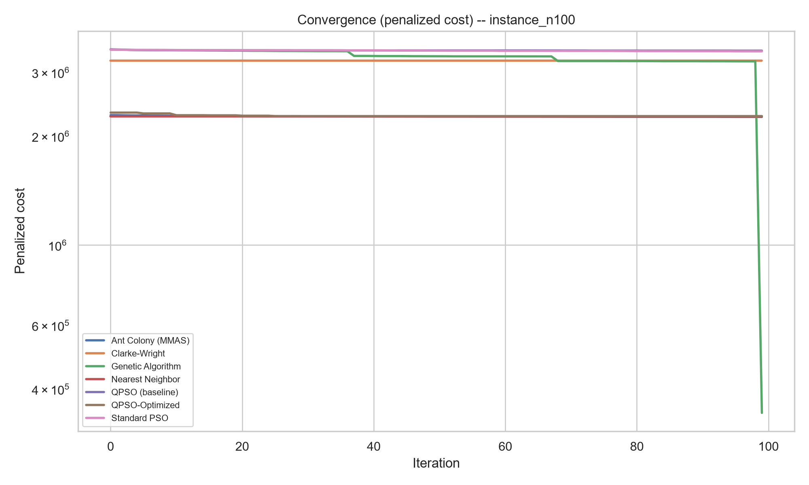
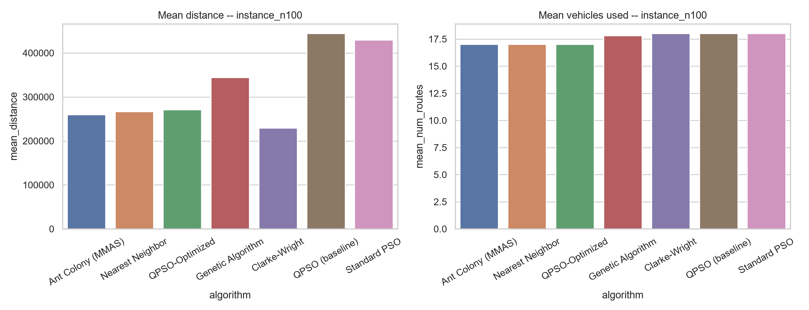
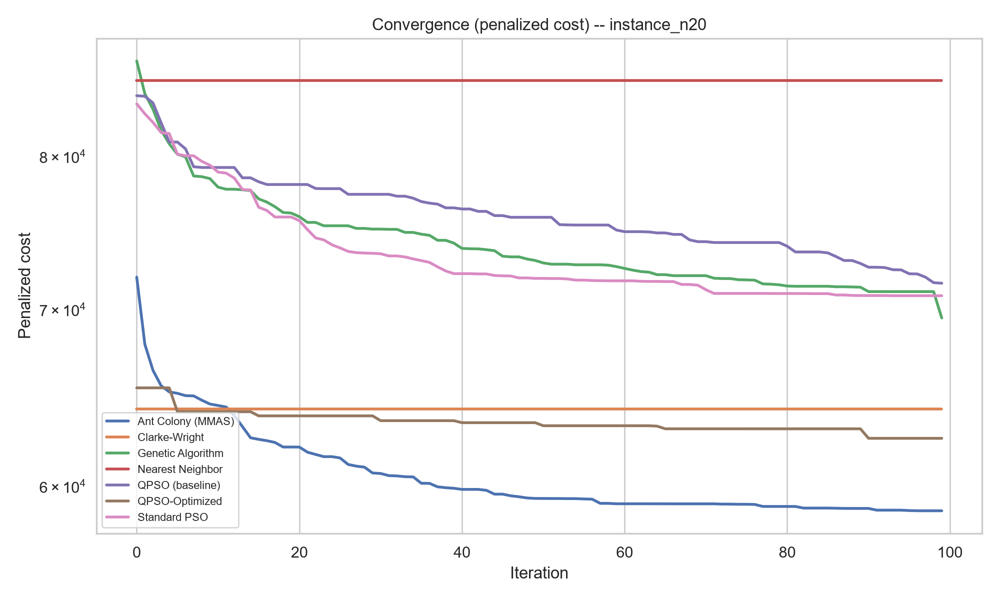
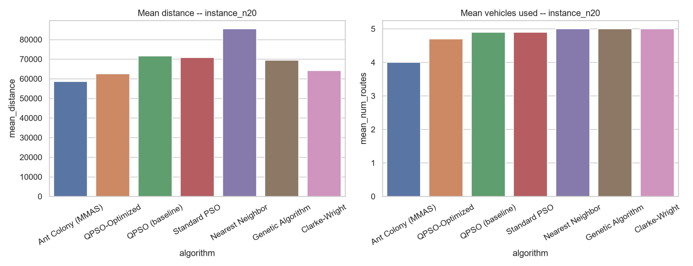
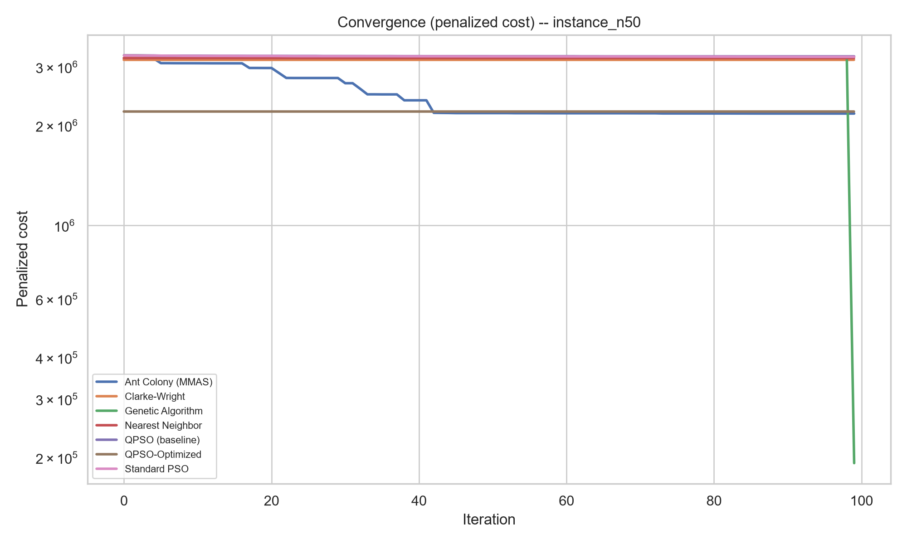
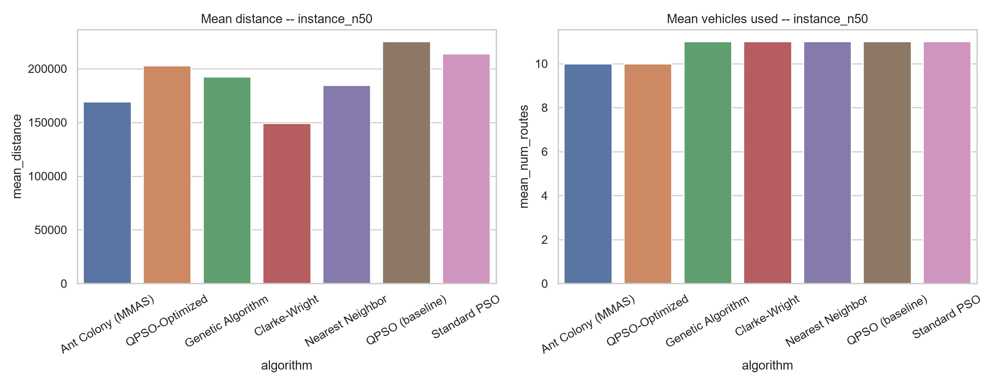

# Optimized QPSO Study

This report re-scores every solver's `.routes` through one uniform evaluator (src/qpso_lab/evaluation.py) instead of trusting each solver's self-reported `total_cost`. Two defects in the frozen benchmark make this necessary: genetic_algorithm.py drops the fleet penalty after 2-opt, and the n=50/n=100 instances need more vehicles than their declared fleet just to cover total demand (a bin-packing lower bound), so every solution to those instances is necessarily penalized. Neither frozen file was modified.

## Leaderboard (ranked by num_routes, then distance)

| instance_id   | algorithm         |   num_routes |   distance |   penalized_cost |
|:--------------|:------------------|-------------:|-----------:|-----------------:|
| instance_n100 | ant_colony_mmas   |           17 |   248214   |      2.24821e+06 |
| instance_n100 | qpso_optimized    |           17 |   251178   |      2.25118e+06 |
| instance_n100 | nearest_neighbor  |           17 |   266702   |      2.2667e+06  |
| instance_n100 | genetic_algorithm |           17 |   335699   |      2.3357e+06  |
| instance_n100 | clarke_wright     |           18 |   228951   |      3.22895e+06 |
| instance_n100 | standard_pso      |           18 |   411305   |      3.41131e+06 |
| instance_n100 | qpso_baseline     |           18 |   429837   |      3.42984e+06 |
| instance_n20  | ant_colony_mmas   |            4 |    58381.9 |  58381.9         |
| instance_n20  | qpso_optimized    |            4 |    58381.9 |  58381.9         |
| instance_n20  | qpso_baseline     |            4 |    66391.6 |  66391.6         |
| instance_n20  | standard_pso      |            4 |    71818.4 |  71818.4         |
| instance_n20  | clarke_wright     |            5 |    64161   |  64161           |
| instance_n20  | genetic_algorithm |            5 |    67087.9 |  67087.9         |
| instance_n20  | nearest_neighbor  |            5 |    85440.1 |  85440.1         |
| instance_n50  | ant_colony_mmas   |           10 |   157129   |      2.15713e+06 |
| instance_n50  | qpso_optimized    |           10 |   202862   |      2.20286e+06 |
| instance_n50  | clarke_wright     |           11 |   149028   |      3.14903e+06 |
| instance_n50  | genetic_algorithm |           11 |   182861   |      3.18286e+06 |
| instance_n50  | nearest_neighbor  |           11 |   184609   |      3.18461e+06 |
| instance_n50  | standard_pso      |           11 |   200729   |      3.20073e+06 |
| instance_n50  | qpso_baseline     |           11 |   218246   |      3.21825e+06 |

## Summary statistics (10-seed mean unless noted)

| instance_id   | algorithm         |   mean_distance |   std_distance |   best_distance |   mean_num_routes |   min_num_routes |   mean_penalized_cost |   std_penalized_cost |   mean_runtime_sec |   mean_converged_iteration |   feasible_fleet_rate |   mean_reported_minus_eval |
|:--------------|:------------------|----------------:|---------------:|----------------:|------------------:|-----------------:|----------------------:|---------------------:|-------------------:|---------------------------:|----------------------:|---------------------------:|
| instance_n100 | Ant Colony (MMAS) |        259573   |       5313.06  |        248214   |              17   |               17 |           2.25957e+06 |             5313.06  |        5.19383     |                       54.3 |                     0 |                    0       |
| instance_n100 | Clarke-Wright     |        228951   |          0     |        228951   |              18   |               18 |           3.22895e+06 |                0     |        0.0404964   |                        0   |                     0 |                    0       |
| instance_n100 | Genetic Algorithm |        343838   |       7486.28  |        335463   |              17.8 |               17 |           3.14384e+06 |           425422     |        0.277708    |                       99   |                     0 |                   -2.8e+06 |
| instance_n100 | Nearest Neighbor  |        266702   |          0     |        266702   |              17   |               17 |           2.2667e+06  |                0     |        0.00138831  |                        0   |                     0 |                    0       |
| instance_n100 | QPSO (baseline)   |        443907   |       7260.2   |        429837   |              18   |               18 |           3.44391e+06 |             7260.2   |        0.263735    |                       51.3 |                     0 |                    0       |
| instance_n100 | QPSO-Optimized    |        271213   |      23352.3   |        251178   |              17   |               17 |           2.27121e+06 |            23352.3   |       10.1767      |                       15   |                     0 |                    0       |
| instance_n100 | Standard PSO      |        429316   |      11125.5   |        411305   |              18   |               18 |           3.42932e+06 |            11125.5   |        0.226271    |                       87.3 |                     0 |                    0       |
| instance_n20  | Ant Colony (MMAS) |         58709.3 |        911.459 |         58381.9 |               4   |                4 |       58709.3         |              911.459 |        0.761812    |                       73.6 |                     1 |                    0       |
| instance_n20  | Clarke-Wright     |         64161   |          0     |         64161   |               5   |                5 |       64161           |                0     |        0.00069952  |                        0   |                     1 |                    0       |
| instance_n20  | Genetic Algorithm |         69460.8 |       2345.29  |         67087.9 |               5   |                5 |       69460.8         |             2345.29  |        0.0892616   |                       99   |                     1 |                    0       |
| instance_n20  | Nearest Neighbor  |         85440.1 |          0     |         85440.1 |               5   |                5 |       85440.1         |                0     |        0.000121522 |                        0   |                     1 |                    0       |
| instance_n20  | QPSO (baseline)   |         71599.5 |       3984.84  |         66391.6 |               4.9 |                4 |       71599.5         |             3984.84  |        0.119801    |                       89.9 |                     1 |                    0       |
| instance_n20  | QPSO-Optimized    |         62539.5 |       2383.73  |         58381.9 |               4.7 |                4 |       62539.5         |             2383.73  |        0.782109    |                       32.5 |                     1 |                    0       |
| instance_n20  | Standard PSO      |         70822.6 |       2515.94  |         66895.2 |               4.9 |                4 |       70822.6         |             2515.94  |        0.0842152   |                       72.9 |                     1 |                    0       |
| instance_n50  | Ant Colony (MMAS) |        169348   |       8993.02  |        157129   |              10   |               10 |           2.16935e+06 |             8993.02  |        2.02455     |                       83.2 |                     0 |                    0       |
| instance_n50  | Clarke-Wright     |        149028   |          0     |        149028   |              11   |               11 |           3.14903e+06 |                0     |        0.00723617  |                        0   |                     0 |                    0       |
| instance_n50  | Genetic Algorithm |        192466   |       6624.73  |        182861   |              11   |               11 |           3.19247e+06 |             6624.73  |        0.168923    |                       99   |                     0 |                   -3e+06   |
| instance_n50  | Nearest Neighbor  |        184609   |          0     |        184609   |              11   |               11 |           3.18461e+06 |                0     |        0.000460052 |                        0   |                     0 |                    0       |
| instance_n50  | QPSO (baseline)   |        225133   |       3916.95  |        218246   |              11   |               11 |           3.22513e+06 |             3916.95  |        0.195956    |                       52.5 |                     0 |                    0       |
| instance_n50  | QPSO-Optimized    |        202862   |          0     |        202862   |              10   |               10 |           2.20286e+06 |                0     |        2.42635     |                        0   |                     0 |                    0       |
| instance_n50  | Standard PSO      |        214001   |       8066.93  |        200729   |              11   |               11 |           3.214e+06   |             8066.93  |        0.149898    |                       86.9 |                     0 |                    0       |

## Component ablation (QPSO-Optimized)

Each rung adds one enhancement on top of the last; V3 vs V4 isolates the Lamarckian write-back specifically (Baldwinian control vs. the real thing).

| instance_id   | algorithm                    |   mean_distance |   std_distance |   best_distance |   mean_num_routes |   min_num_routes |   mean_penalized_cost |   std_penalized_cost |   mean_runtime_sec |   mean_converged_iteration |   feasible_fleet_rate |   mean_reported_minus_eval |
|:--------------|:-----------------------------|----------------:|---------------:|----------------:|------------------:|-----------------:|----------------------:|---------------------:|-------------------:|---------------------------:|----------------------:|---------------------------:|
| instance_n100 | V1_prins_split_unconstrained |        289992   |        4712.07 |        282878   |              18   |               18 |           3.28999e+06 |              4712.07 |           1.66075  |                       99   |                     0 |                0           |
| instance_n100 | V2_fleet_bounded_split       |        290751   |        5780.71 |        281844   |              18   |               18 |           3.29075e+06 |              5780.71 |           9.43355  |                       99   |                     0 |                0           |
| instance_n100 | V3_local_search_baldwinian   |        257035   |        9342.2  |        242135   |              17.5 |               17 |           2.75704e+06 |            523984    |          11.2458   |                       12.5 |                     0 |                0           |
| instance_n100 | V4_lamarckian_writeback      |        255075   |       10972.5  |        238651   |              17.6 |               17 |           2.85508e+06 |            511869    |          10.9726   |                       12   |                     0 |                0           |
| instance_n100 | V5_full_solver               |        271213   |       23352.3  |        251178   |              17   |               17 |           2.27121e+06 |             23352.3  |           9.81444  |                       15   |                     0 |                0           |
| instance_n20  | V1_prins_split_unconstrained |         64812.7 |        2637.69 |         60896   |               4.9 |                4 |       64812.7         |              2637.69 |           0.291389 |                       99   |                     1 |                0           |
| instance_n20  | V2_fleet_bounded_split       |         65119   |        2594.7  |         58750.8 |               4.9 |                4 |       65119           |              2594.7  |           0.627147 |                       99   |                     1 |                0           |
| instance_n20  | V3_local_search_baldwinian   |         64570   |        2433.07 |         58381.9 |               4.9 |                4 |       64570           |              2433.07 |           0.726697 |                        4   |                     1 |                0           |
| instance_n20  | V4_lamarckian_writeback      |         63833.5 |        2371.57 |         58381.9 |               4.9 |                4 |       63833.5         |              2371.57 |           0.67397  |                       36.8 |                     1 |               -0.000292969 |
| instance_n20  | V5_full_solver               |         62539.5 |        2383.73 |         58381.9 |               4.7 |                4 |       62539.5         |              2383.73 |           0.675957 |                       32.5 |                     1 |                0           |
| instance_n50  | V1_prins_split_unconstrained |        173594   |        5108.96 |        166717   |              11   |               11 |           3.17359e+06 |              5108.96 |           0.608855 |                       99   |                     0 |                0           |
| instance_n50  | V2_fleet_bounded_split       |        171681   |        5792.51 |        160283   |              11   |               11 |           3.17168e+06 |              5792.51 |           2.40537  |                       99   |                     0 |                0           |
| instance_n50  | V3_local_search_baldwinian   |        162004   |        4863.65 |        154719   |              11   |               11 |           3.162e+06   |              4863.65 |           2.86599  |                       10   |                     0 |                0           |
| instance_n50  | V4_lamarckian_writeback      |        162004   |        4863.65 |        154719   |              11   |               11 |           3.162e+06   |              4863.65 |           3.56458  |                       10   |                     0 |                0           |
| instance_n50  | V5_full_solver               |        202862   |           0    |        202862   |              10   |               10 |           2.20286e+06 |                 0    |           2.41409  |                        0   |                     0 |                0           |

## OR-Tools reference

| instance | lower bound vehicles | declared fleet feasible? | relaxed fleet | relaxed distance |
| :--- | :--- | :--- | :--- | :--- |
| instance_n20 | 4 | True | 5 | 58381.85 |
| instance_n50 | 10 | False | 10 | infeasible within time limit |
| instance_n100 | 17 | False | 17 | 222766.04 |

## Plots

### instance_n100

### instance_n20

### instance_n50

